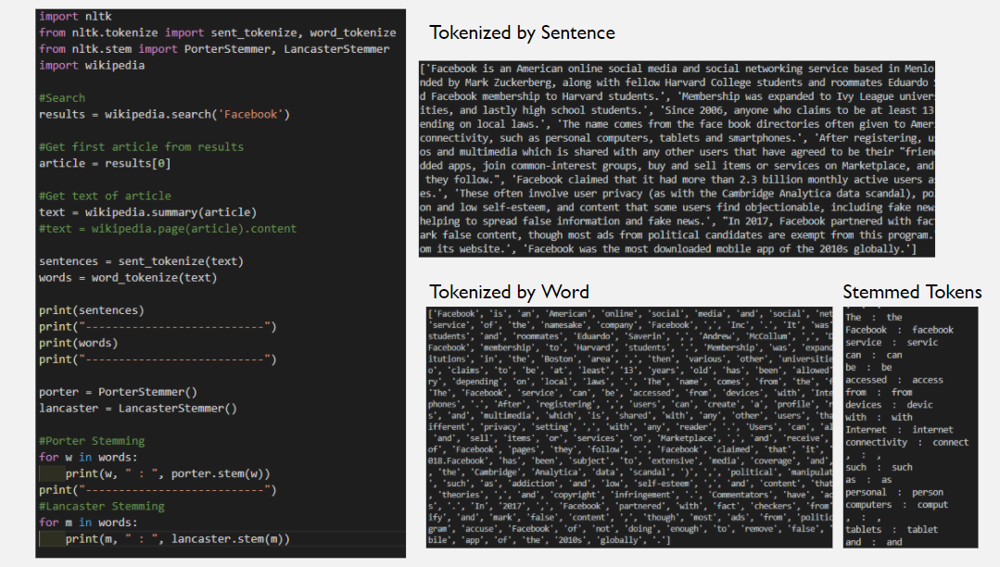
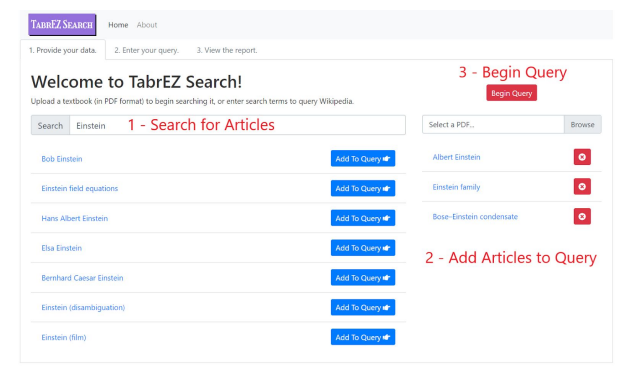
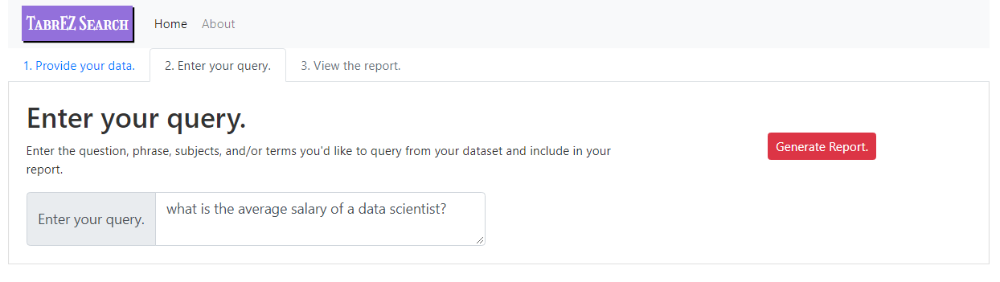
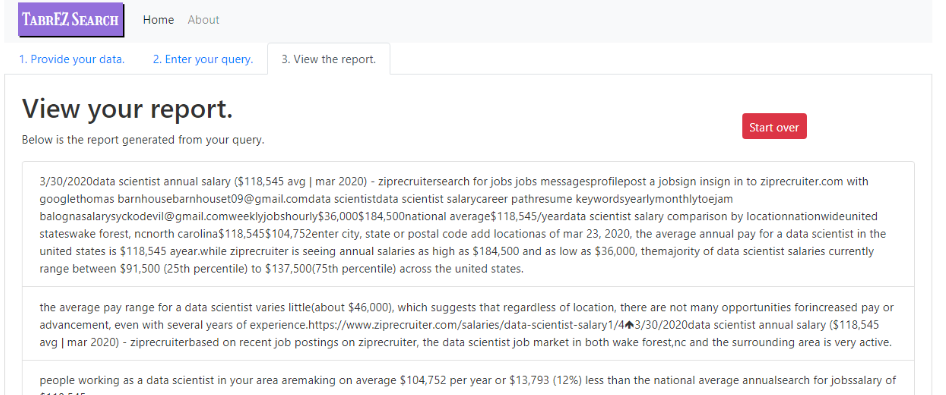

# Introduction

This is the repo for the Wikipedia & Textbook Search

      

   [Report summary](https://drive.google.com/file/d/1KdcjJm2ApnHMBJrn0Cyp0E8OM-K0mMLw/view?usp=sharing) 
   [Presentation link ](https://drive.google.com/file/d/1m6E_yLkk8p1B1G22JKybCp_eFi3Xk9S04IlyB0gXNM0/view?usp=sharing)  

# Abstract

The objective of this project proposal is to provide a web-based search engine that gives users the ability to query Wikipedia and user-supplied PDF files. These PDF files can range from anything to research articles or to full-fledged textbooks.

It currently contains the following projects:

- A python project for performing searches on wikipedia articles
- A python project for providing APIs for external applications
- An angular web application project

# Table of contents

- [Quickstart](#quickstart)
    - [Markdown Information](#markdown-information)
    - [Software Requirements](#software-requirements)
    - [Cloning the repo](#cloning-the-repo)
    - [Committing changes](#committing-changes)
- [Changelog](#changelog)
- [Method](#method)
    - [Tokenization, Case-Folding, Stemming](#tokenization-case-folding-stemming)
    - [TF-idf vectorization](#tf-idf-vectorization)
- [User Interface](#user-interface)
    - [Python Project](#python-project)
    - [Angular Project](#angular-project)
- [Conclusion](#conclusion)

# Quickstart

## Markdown Information
This readme file is written in a format called Markdown.
Markdown is what's normally used for writing the summary of repos you see in github and other repository management systems.

See these links for more on how to use MarkDown:

- https://www.markdownguide.org/basic-syntax
- https://www.markdownguide.org/cheat-sheet

## Software Requirements
In order to compile and execute these projects, you'll need to install the following:

- Git:
    - https://git-scm.com/downloads    
- NodeJS: https://nodejs.org/en/
    - Either the LTS/recommended or current version will work.
    - This will also install npm package manager
    - Node and NPM allow us to quickly install and manage external programming libraries within our projects.
- Python v3.8.1: https://www.python.org/downloads/release/python-381/
- Visual Studio Code: https://code.visualstudio.com/
    - This is Microsoft's newest IDE/code editor.
- Here is a list of extensions that'll be helpful for you while using Visual Studio Code:
    - Azure Repos: https://marketplace.visualstudio.com/items?itemName=ms-vsts.team
    - Git Project Manager: https://marketplace.visualstudio.com/items?itemName=felipecaputo.git-project-manager
    - Python: https://marketplace.visualstudio.com/items?itemName=ms-python.python

## Cloning the repo

Once all of the software requirements have been installed:

1. Open visual studio code and press F1 to open the command palette search.

2. Search for the Git: Clone command

    
    
    If this doesn't show up, make sure you have the Azure Repos and Git Project Manager extensions installed

3. Once selected, you'll be prompted to paste the repository url

    

4. Paste the following URL: https://DASC-Group-1@dev.azure.com/DASC-Group-1/Wikipedia%20And%20Textbook%20Search%20Engine/_git/Wikipedia%20And%20Textbook%20Search%20Engine

5. It will then ask you to select a folder to clone the repo's files to. Select where you want the files to be downloaded to.

6. Once it's complete, vscode will reopen to the cloned directory. You can view the project's files in the file explorer. View the explorer by clicking the double-file icon at the top left of vscode:

    

## Committing changes

If you've made changes that you'd like to push to the branch, you'll want to open the source control window in vscode, add a commit comment, and commit then sync your changes.

1. To open the source control window, click this button in vscode:

    

2. Review the changes you've made in this window. Make sure nothing weird is going on- sometimes you'll see changes to files you don't expect. You can discard or ignore changes you don't want by right-clicking them and choosing to do so:

    

3. Once you're happy with the changes to the files listed in the source control viewer, enter a commit message and click 'Commit':

    

4. Once the changes are committed, sync the changes to the repo in git:

    

5. Your commits should now be synced up to the repository!

# Changelog

- 20200130: Create the repo, angular web app, and some python examples from a tutorial
    - Python tutorial: https://code.visualstudio.com/docs/python/python-tutorial
- 20200217: 
    - Added requirements.txt file for installing necessary python packages
    - Added .gitignore and modified it so the .venv and node_modules folders are ignored by source control
        - This is so the hundreds of files from each are left out of our checkins
        - Our checkin should strictly be dealing with code. Changes to packages should be noted in the requirements.txt file for python and package.json for angular
    - Added Cloning the repo and Committing changes sections to the readme

# Method

Our Search engine uses the Wikipedia API library for python that makes it easy to access and parse data from Wikipedia.

The Wikipedia API wraps the MediaWiki action API which is a web service that allows access to some wiki-features like authentication, page operations, and search. It can provide meta information about the wiki and the logged-in user. This helps us focus on using Wikipedia data, not getting it.

CirrusSearch is a MediaWiki extension that uses Elasticsearch to provide enhanced search features over the default MediaWiki search. The Wikimedia Foundation uses CirrusSearch for all Wikimedia projects. CirrusSearch takes care of Indexing and Web Crawling the entire Wikipedia Site and updates to the search index are done in near real time. Changes to pages appear immediately in the search results. CirrusSearch optimizes your query, and runs it. The resulting titles are weighted by relevance, and heavily post-processed, 20 at a time, for the search results page.

All pages are stored in the wiki database, and all the words in the non-redirect pages are stored in the search database, which is an index to practically the full text of the wiki. Each visible word is indexed to the list of pages where it is found, so a search for a word is as fast as looking up a single-record. Furthermore, for any changes in wording, the search index is updated within seconds.

There are many indexes of the "full text" of the wiki to facilitate the many types of searches needed. The full wikitext is indexed many times into many special-purpose indexes, each parsing the wikitext in whatever way optimizes their use.

## Tokenization, Case-Folding, Stemming

In order to build a search engine, an inverted index is constructed to map tokens to the documents that they appear in. Our search engine supports Boolean search queries using the standard Boolean operators AND, OR, and NOT. 
As you can see in Figure 1, the text is tokenized first in order to construct an inverted index. We normalize the text through case folding. 

    

 #### Figure 1 - This code snippet shows the python code for how the text that is tokenized and creation of the inverted index.

 ## TF-idf vectorization
 One of the features that we have incorporated in our Search engine is to offer suggestions  which are similar to the user query. Using sci-kit learn library, we calculated TF-idf values for documents and the query to determine the most relevant documents for a given query. 

We then apply the concept of Nearest Neighbors to get the results which are similar to the user supplied query.  This similarity is found by euclidean distance of the top words most commonly found in the article and tf-idf vectorizer to find relative importance of these words and comparing these words with other results.  A distance is then calculated by the Nearest Neighbor algorithm which helps us decide which results are closest to the User query.

    

  #### Figure 2 - This code snippet shows the the implementation of the k nearest neighbors to create normalized vectors.

 # User Interface

 ## Python Project:
 We envision the python project to include concepts from the chapters for indexing
& retrieval of search results. For coding in Python, we plan to use VisualStudio Code
IDE. VisualStudio Code has the GIT extensions available so it's possible to have a
seamless experience collaborating with Project team members. We plan to split the code
chapterwise and have each team member contribute accordingly to the code. Post coding
we plan to integrate the different components so that the system is able to deliver the
overarching functionality while ensuring that the subsystems function together as a
system.

## Angular Project:
The angular project was generated using the angular CLI. It is still mostly just a
blank web application, but the initial proof of concept contains a couple of components
that had to be created by hand. There is a component for accepting user input for
searching wikipedia, and a component for the general layout of the website. There will be another component created later on for displaying the report. There is going to need to be some styling added to the website later on too, as the proof of concept was more about showcasing functionality. Here is a screengrab of the current implementation of the web app returning and displaying article names queried from wikipedia in real-time.

    
 #### Figure 3 - When opening the web application, the user is presented with a textbox for searching for wikipedia articles as well as a file selector for choosing a PDF to upload. The idea is that the app will step through each action the user has to take in order to perform their query. 
 

    
 #### Figure 4 - If the user prefers, they can search for Wikipedia articles to include in the query that they’ll be performing. They do this by typing the names of articles they’re interested in, and selecting the results returned by Wikipedia’s API:
 

    
 #### Figure 5 - The current implementation uses the NLTK library to parse out all of the sentences from the selected data. We then display this data to the report page.

 

# Conclusion

Within this report we describe how our web application utilizes the Wikipedia API to
perform web crawling and indexing of the data from Wikipedia. Fortunately, we had
implemented this functionality within the web application when we first started. As a synopsis, the web application uses the Wikipedia API to search for certain articles and in return the API crawls through the entire Wikipedia API in search of the articles while simultaneously indexing the data as well. Being able to index the data speeds up the process of searching since we do not need to crawl through the entire Wikipedia site numerous times.